## Sitio Web

Para la descarga de datos de Índice Nacional de Precios al Consumidor (INPC) utlizamos el siguiente link: https://www.inegi.org.mx/programas/inpc/2018a/default.html#tabulados

Aquí podremos encontrar un menú como este:

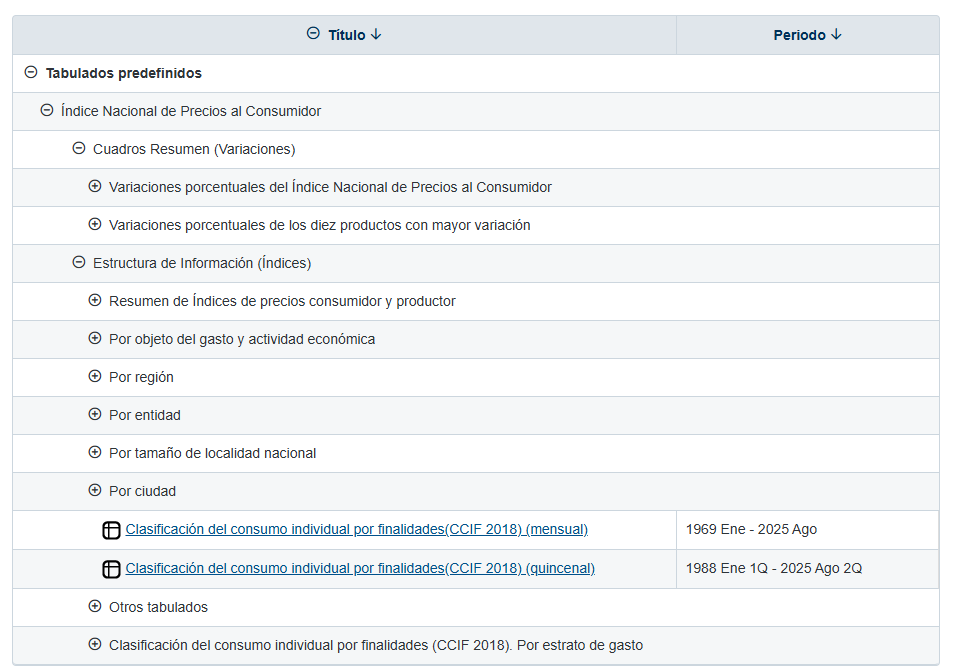

A nosotros nos interesan las pestañas de "Por entidad" y "Por ciudad", que al hacer click en ellas nos generan la lista ya sea de entidades o ciudades dependiendo el caso, donde podremos escoger una de ellas.

Cada estado o ciudad viene duplicada, una para mensual y otra para quincenal, que se refiere a la temporalidad con la que vienen reportados los indices.

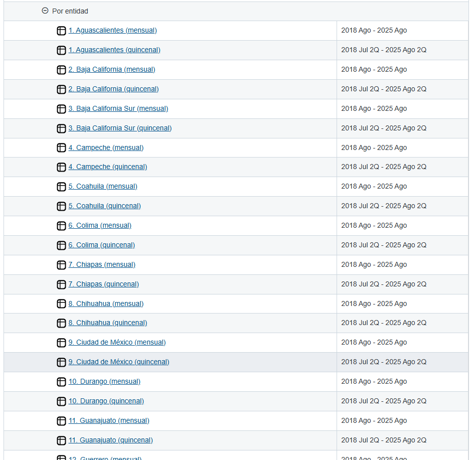

Al seleccionar uno de ellos seremos enviados a una nueva página para, ahora sí, descargar los datos.

En nuestro ejemplo seleccionaremos "Por ciudad" y "Acapulco, Gro. (quincenal)", con el link:

inegi.org.mx/app/indicesdepreciosv2/Estructura.aspx?idEstructura=1120016000600020&T=Índices de Precios al Consumidor&ST=Acapulco, Gro. (quincenal)

Llegaremos a una página con un menú como este:

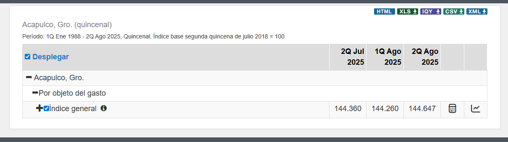

Observamos nuestra selección, el periodo con el que se cuentan los datos, varios botones para descargar los datos en diferentes formatos, así como lo que hemos venidos a buscar , la pestaña "Por objeto de gasto", que de facto viene "abierta", permitiendo descargar los datos por "Índice general".

## Problemas

Si tras llegar a la página lo primero que hacemos es presionar uno de los botones de descarga, por ejemplo el CSV, y tras seleccionar nuestras preferencia de descarga obtendremos un excell que se ve así:

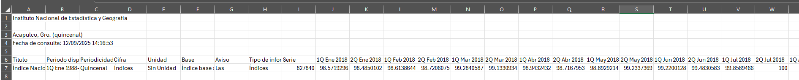

NO TIENE NADA!

Por lo cual si queremos más información (más filas del excell) tendremos que ir abriendo pestañas de clasificación de nuestro menú. Al presionar "Índice general" tenemos:

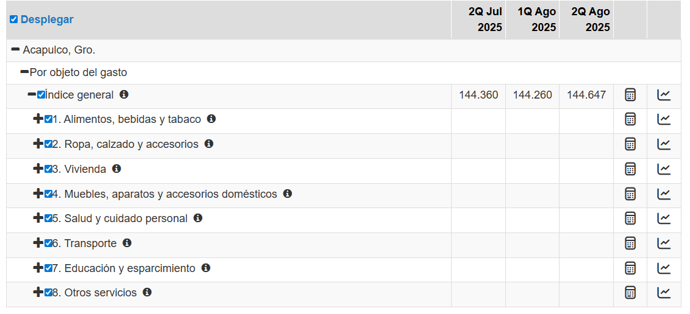

y si descargamos, obtenemos un excell como el siguiente:

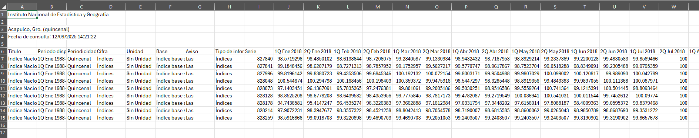

Ya tiene 9 filas! Es un avance, miserable, pero un avance.

Si continuamos abriendo pestañas como "1. Alimentos, bebidas y tabaco" obtendremos más pestañas y más datos para nuestro excell. Es decir, bajo este proceso, el excell SOLO contendra la información de aquellas pestañas que estamos viendo en el menú, si no la haz abierto, NO aparecerá en el excell.

Quizá no suene tan mal, hacer click para abrir las pestañas y descargar los datos, el problema es que para obtener toda la información de nuestra ciudad o estado, hay que hacer click más de 130 veces, sumado a que al abiri una pestaña las siguientes se van cada vez más abajo, dificulta un poco el asegurarnos de que esten todas abiertas y no morir en el intento.

Pobre de aquel que quiera los datos de las 55 ciudades, serían más de 7 MIL CLICKS!

## Abrir Pestañas

Es hora de pensar en una solución, pues el tiempo es oro, para ello empezaremos a usar las herramientas de DevTools.

Al inspeccionar los elementos de la tabla de menú que funcionan como pestañas de clasificación para generar más pestañas, por ejemplo, "Indice general" nos encontraremos objetos com este:

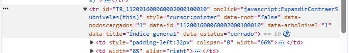

Donde podemos ver dos cosas importantes que resalta a nuestra vista, "onclick" y "data-estatus", donde la primera indica lo que hará la página cuando se haga click en este elemnto (TODA la fila de la tabla), que en este caso ejecuta "ExpandirContraerSubniveles" a este elemento, que como vimos anteriormente despliega o contrae las pestañas subsecuentes. La segunda en mi caso tiene el valor "cerrado" pues no he hecho click para desplegar más pestañas.

Ahora, si hacemos click en esta pestaña, además de generarse las pestañas subsecuentes podemos ver un cambio en data-estatus, pues ahora toma el valor de "abierto":

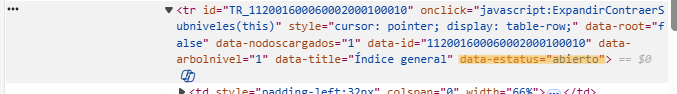

Si volvieramos a hacer click en la pestaña volvería a valer "cerrado". Con esto ya tenemos un objetivo claro de que hacer: Hacer click sobre todas aquellas pestañas con el valor data-status="cerrado".

He aquí, ante ustedes, la solución más rápida y segura para abrir todas esas molestas pestañas!

```{r}
#const cerrados = document.querySelectorAll('tr[data-estatus="cerrado"]');
#console.log(cerrados);
#cerrados.forEach(tr => {
#    tr.click();
#});
```

Un bonito código que primero busca los elementos tr, que son las filas de la tabal de menú que representan las pestañas que tengan el atributo data-estatus con el valor "cerrado", los guardara en una lista, los imprime para que podamos verlos y posteriormente, uno a uno, activa el evento click sobre ellos, con lo que expanden sus pestañas subsecuentes.

Pegaremos este código en la Consola de la página (a la que podemos acceder al presionar F12 o Click derecho \>\> Inspeccionar).

Aquí lo pegaremos y al ejecutarlo obtendremos lo siguiente:

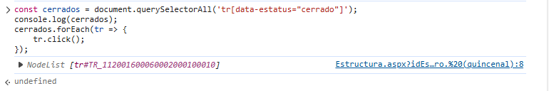

indicando que ha abierto la primera pestala cerrada, "Índice general". Si con las flechas del teclado nos desplazamos hacia arriba wen la consola obtendremos nuevamente la última línea que ejecutamos, que en nuestro caso debería ser todo el código, si ejecutamos nuevamente obtenemos:

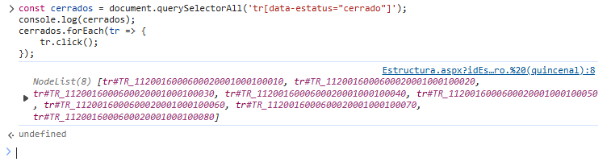

que nos indica que ha abierto las siguientes 8 pestañas cerradas, que son "1. Alimentos, bebidas, y tabaco", "2. Ropa, calzado y accesorios", etc.

Te podrás dar cuenta que no abre todas las pestañas posibles y te preguntaras "¿Por qué no las abre si no están abiertas? pues si no puedo ver las pestañas subsecuentes quiere decir que están cerradas". El problema es que estas pestañas NO EXISTEN hasta que la pestaña predecesora es abierta por primera vez, por lo que es necesario ejecutar nuevamente el código unas cuatro veces más y tendríamos TODAS las pestañas abiertas.

IMPORTANTE: Cada vez que ejecutemos el código hay que esperar unos dos segundos antes de volver a ejecutarlo, pues de otra forma no daremos tiempo suficiente a que las pestañas subsecuentes se cargen y al código le será imposible encontrarlas para abrirlas.

Así tendríamos abierto todo nuestras pestañas y sin hacer más de 130 cliks.

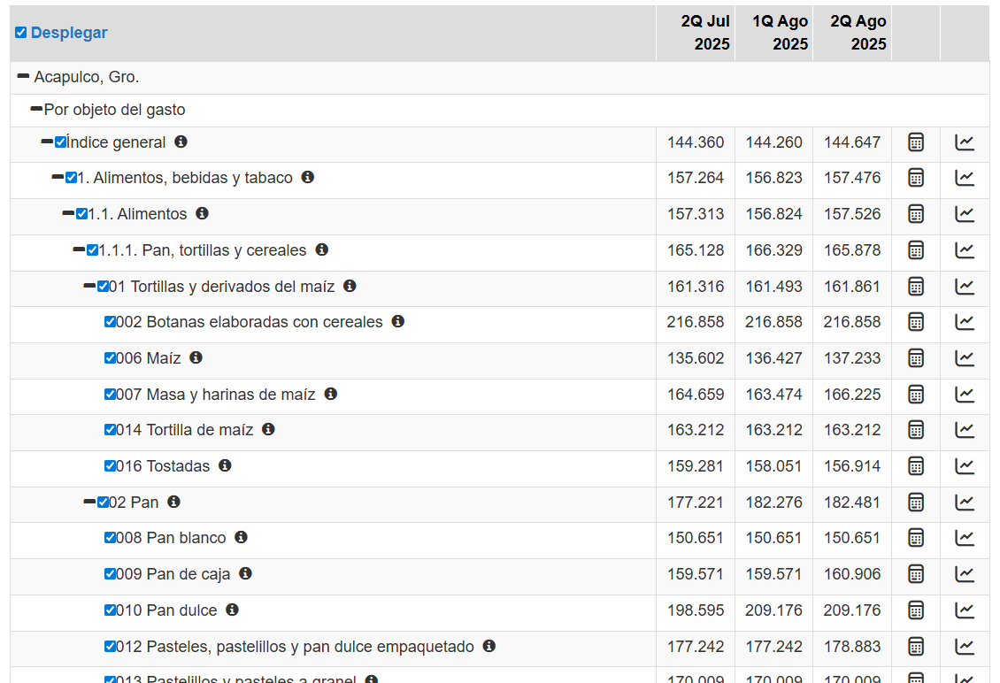

Antes de descargar cabe notar algo, si vuelves a ejecutar el código aparecerá que abrió 292 pestañas, pero tranquilo, no es que nos hayan faltado, si no que al ser las ultimas (jerarquicamente) como la de "002 Botanas elaboradas con cereales" no tienen pestañas subsecuentes, por lo que aunque conserven el estatus de "cerrado" no nos afecta, sin embargo puedes abrirlas por cualquier cosa.

Si nuevamente ejecutas el código ya no deberían aparecer los id de ninguna pestaña, de lo contrario, indicaría que no diste el tiempo sufuciente entre ejecuciones para que las pestañas se vayan cargando.

Me gustaría dejar en claro que es posible crear un código que se ejecute solo una vez y abra todas las pestañas, sin embargo mis capacidades me impiden hacer uno que no se tarde más de 3 minutos, pues es necesario que el programa realice pausas para esperar eventos de carga, y esto lo vuelve muy poco práctico.

Continunando, ahora sí podemos descargar, recomendamos la siguiente elección:

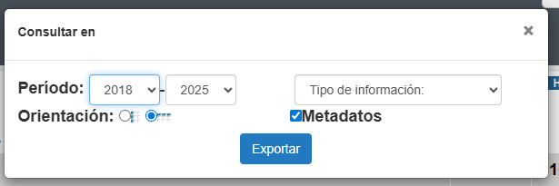 pues no todas las ciudades tienen datos antes del 2018 y la disposición por columnas es más fácil de tratar a continuación.

Repite el proceso con tantas ciudades como gustes.

## Clasificar con R

Nuestro amigo Jair hizo un código que después se actualizó y quedo el siguiente:

```{r}
#INPC_Clasificar_2
Extraer=function(ags_1){
  if("Quincenal" %in% ags_1$Periodicidad){
    ags_1=ags_1[!(grepl("(SCIAN 2018)",ags_1[,1])),seq_along(colnames(ags_1)) <= 9 | as.numeric(substr(colnames(ags_1),8,11))>=2018]
  }else{
    ags_1=ags_1[!(grepl("(SCIAN 2018)",ags_1[,1])),seq_along(colnames(ags_1)) <= 9 | substr(colnames(ags_1),5,6)%in%c(18,19,20,21,22,23,24,25)]
  }
  ags_1[, paste0("class_", 1:5)] <- ags_1$Título |>
    sapply(function(x) {
      # 1. Extraer después de "Índice general, "
      parte_util <- strsplit(x, split = "Índice general, ")[[1]][2]
      
      # 2. Split por expresiones numéricas
      if (!is.na(parte_util)) {
        partes <- strsplit(parte_util, split = ", (?=\\d)", perl = TRUE)[[1]]
        partes <- stringr::str_squish(partes)
      } else {
        partes <- character(0)
      }
      #partes
      length(partes) = 5
      partes[is.na(partes)] = NA
      
      return(partes)
    }) |>
    t()
  return (ags_1)
}

```

Aqui se declara una función que llamamos "Extraer" que en escencia recibirá un data.frame y buscará en la columna "Título" comas espacios y numeros para encontrar las posibles clasificaciones y colocarlas en nuevas columnas llamadas class_1,class_2,etc.

Cabe recalcar que lo primero que hace la función es quitar todas las entradas que contengan "por origen de los bienes (SCIAN 2018)", pues son entradas que viene si la página contaba con una pestaña "Índice de precios al consumidor, por origen de los bienes (SCIAN 2018)" que a nosotros no nos interesan por el momento. Además de quitar aquellas columnas de quincenas o meses anteriores a 2018, pues como digo no todas las ciudades cuentan con ellas.

En nuestro caso este código lo guardaremos con el nombre de "INPC_Clasificar_2.R"

## Juntar

Ya solo queda aplicarlos a todos nuestros datos y juntarlos, para ello usamos el código:

```{r}
##Clasificar, Juntar y Guardar

##Indices quincenales para cada estado
#library(dplyr)

Leer_csv_INPC=function(C){
  return (read.csv(C,fileEncoding = "latin1",check.names = F,skip = 5)) ##El skip=5 quita las primeras 5 filas que causan error
}
#Función para quitar las columnas repetidas y/o vacías que se generan al descargar los datos
No_Vacias=function(X){
  auxi=numeric(length(names(X)))
  for(i in 1:length(names(X))){
    if(all(X[,i]=="N/E")==F){
      auxi[i]=i
    }
  }
  return(X[,auxi[auxi!=0]])
}
####ATENCIÓN!!!#################################################################
##Hay que cambiar la ruta; hay cuatro posibles:
##R="Quincenal/Estatal/"
#R="Quincenal/Ciudad/"
##R="Mensual/Estatal/"
##R="Mensual/Ciudad/"
################################################################################

#Indices = list.files(path = R, pattern = ".CSV$", full.names = T, recursive = T) |>
#  lapply(Leer_csv_INPC) |> lapply(No_Vacias)


#source("INPC_Clasificar_2.R")
#Indices_Clasificados=lapply(Indices, Extraer)

#INPC=do.call(plyr::rbind.fill,Indices_Clasificados)

##Cambia el nombre por el que quieras
#write.csv(INPC,paste0("INPC_",gsub("\\/","\\_",R),"2018_2025",".csv"),row.names = F)

```

El cual hace algunas cosas para que todo quede bonito y lo explicamos paso a paso:

Paso 1: Funciones para Ajustar

```{r}
Leer_csv_INPC=function(C){
  return (read.csv(C,fileEncoding = "latin1",check.names = F,skip = 5)) #El skip=5 quita las primeras 5 filas que causan error
}
#Función para quitar las columnas repetidas y/o vacías que se generan al descargar los datos
No_Vacias=function(X){
  auxi=numeric(length(names(X)))
  for(i in 1:length(names(X))){
    if(all(X[,i]=="N/E")==F){
      auxi[i]=i
    }
  }
  return(X[,auxi[auxi!=0]])
}
```

declara dos funciones, una para leer un .csv con las características que necesitamos, concretamente se salta las primeras 5 lineas que no nos sirven del excell, y la segunda que va a quitar aquellas columnas que estén vacías, pues por alguna razón al descargar los datos pueden duplicarse columnas como la "2Q Ago 2018" y una ser vacía, con lo cual quitamos esa que no nos srive.

Paso 2: Leer todos los datos

```{r}
####ATENCIÓN!!!#################################################################
##Hay que cambiar la ruta; hay cuatro posibles:
##R="Quincenal/Estatal/"
#R="Quincenal/Ciudad/"
##R="Mensual/Estatal/"
##R="Mensual/Ciudad/"
################################################################################

#Indices = list.files(path = R, pattern = ".CSV$", full.names = T, recursive = T) |>
#  lapply(Leer_csv_INPC) |> lapply(No_Vacias)
```

Aquí recomendamos que los datos estén guardados en carpetas subsecuentes como "Quincenal" y "Mensual" y que contengan otras que sean "Estatatal" y "Ciudad", para mayor facilidad. Así buscamos en esa combinación de carpetas que nos interesa todos los .csv que descargamos , los leemos uno a uno con las especificaciones y ajustamos con las dos funciones anteriores.

Paso 3: Clasificar y Guardar

```{r}
#source("INPC_Clasificar_2.R")
#Indices_Clasificados=lapply(Indices, Extraer)

#INPC=do.call(plyr::rbind.fill,Indices_Clasificados)

##Cambia el nombre por el que quieras
#write.csv(INPC,paste0("INPC_",gsub("\\/","\\_",R),"2018_2025",".csv"),row.names = F)

```

Ahora simplemente ejecutamos el código anterior que contiene nuestra función Extraer y así para poderla usar en cada uno de los .csv guardados en "Indices". Posteriormente los juntamos en un solo data.frame para poder guardarlo.

Paso 4: Disfruta

Ahora sí, ya tenemos nuestro documento con todas las ciudades o estados.

Por ahora es todo.
